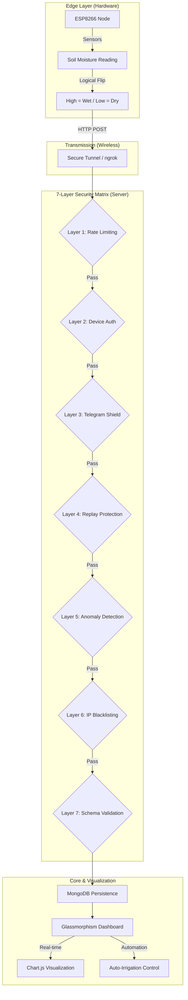

# 🛡️ SmartAgri: 7-Layer Secured IoT Ecosystem

A high-resilience, precision agriculture monitoring system built with **Node.js**, **MongoDB**, and **ESP8266**. This project demonstrates a **Defense-in-Depth** security architecture designed to protect IoT infrastructure from modern network threats.

---

## 🏗️ System Architecture

---

## 🛡️ The 7-Layer Security Matrix

| Layer | Name | Description | Algorithm / Mechanism |
| :--- | :--- | :--- | :--- |
| **L1** | **Intelligent Rate Limiting** | Throttles DDoS and brute-force traffic. | Fixed Window (100 req/min) |
| **L2** | **Hardware Handshake** | Authenticates hardware via unique Device ID & Tokens. | Pre-shared Secret Matching |
| **L3** | **Telegram Shield** | Pushes real-time encrypted alerts for intrusion attempts. | HTML Bot API Notification |
| **L4** | **Temporal Guard** | Prevents Man-in-the-Middle Replay Attacks. | Milis-based Time Sync |
| **L5** | **Behavioral Anomaly Detection** | Flags raw ADC sensor outliers and physical tampering. | Range-Bound (0-1024) |
| **L6** | **Autonomous IP Blacklist** | Automatically bans offensive IPs at the server gate. | Violation-Counter (Threshold: 5) |
| **L7** | **Zero-Trust Schema** | Rejects payloads with extra fields or malicious scripts. | Whitelist Metadata Validation |

---

## 🚀 Quick Start

### 1. Server Setup
1. Clone the repository.
2. Install dependencies: `npm install`.
3. Create a `.env` file from the provided template.
4. Start the server: `node server.js`.

### 2. Hardware Setup
1. Open `soil_ardino_code.ino` in the Arduino IDE.
2. Update the `SSID` and `PASSWORD` placeholders with your WiFi details.
3. Update the `serverURL` with your local IP or ngrok address.
4. Flash to your ESP8266.

---

## 🧪 Security Demonstrations
We have included a `POSTMAN_DEMO_GUIDE.md` and a `security_demo.sh` script to help you simulate various attacks (Hacker Spoofing, Replay Attacks, Payload Injection) and see the security layers in action.

---

## 🎓 Graduation Demo Package
- **Presentation Guide**: [PRESENTATION_GUIDE.md](./PRESENTATION_GUIDE.md)
- **Security Overview**: [IOT_SECURITY_OVERVIEW.md](./IOT_SECURITY_OVERVIEW.md)
- **Demo Checklist**: [DEMO_DAY_CHECKLIST.md](./DEMO_DAY_CHECKLIST.md)
